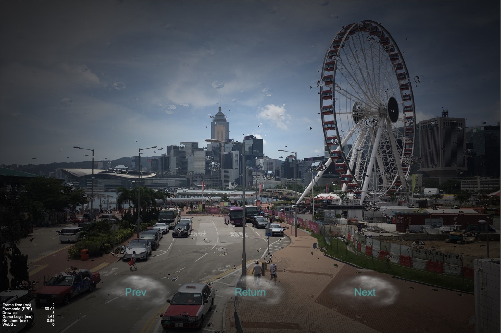
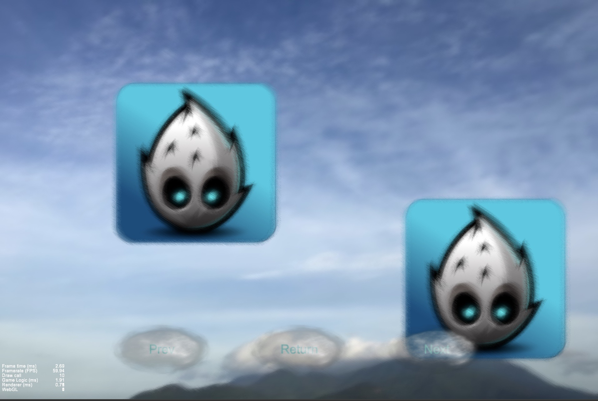
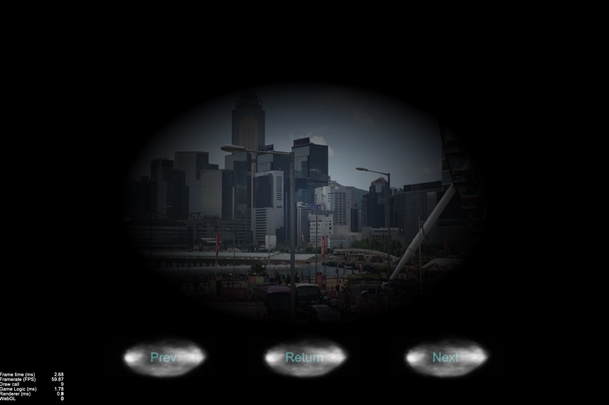

# CreatorShaderDemo

Shader demo based on the material system of Cocos Creator.

## CustomRenderComponent & CustomAssembler

CustomRenderComponent must override the two methods _resetAssembler and _activateMaterial.

```js
    //override
    _resetAssembler () {
        this.setVertsDirty(true);
        this._assembler = new CustomAssembler();
        this._assembler.init(this);
    }

    //override
    _activateMaterial () {
        let material = this.sharedMaterials[0];
        if (!material) {
            this.disableRender();
            return;
        }
        
        material = cc.Material.getInstantiatedMaterial(material, this);
        this.setMaterial(0, material);
        this.markForRender(true);
    }
```

CustomAssembler must override methods init, updateRenderData and fillBuffers.

```js
   init (comp) {
        super.init(comp);
        this._renderData = new cc.RenderData();
        this._renderData.init(this);

        this.initLocal();
        this.initData();
    }

    //override
    updateRenderData (comp) {
        if (comp._vertsDirty) {
            this.updateUVs(comp);
            this.updateVerts(comp);
            comp._vertsDirty = false;
        }
    }
```

## Material & Effect

Transplant some 2D Shaders to learn the new material system.

天气相关：

滚动背景


云


雨



雪


图片相关：

使用RenderTexture进行屏幕后处理：



GamePlay:

点光源：


